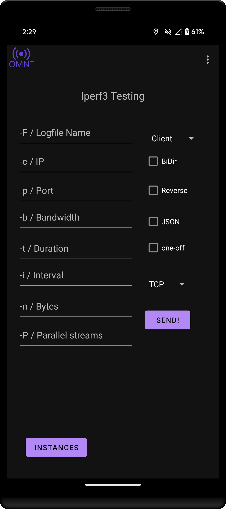

# OpenMobileNetworkToolkit

OMNT provides tooling to researchers and developers of mobile communication networks like 3GPP 2/3/4/5G.
The main objective of OMNT is the collection of measurement data on the mobile network like RSSI, RSRQ, RSRP, GNSS position, Cell ID, PLNM and much more.
On top of those passive measurements on the radio environment and network parameters, OMNT can also run a iPerf3 server / client for bandwidth, latency and jitter evaluation as well as
round-trip-time and jitter evaluation via ICMP (Ping). Measurement data can be stored locally and / or send to an InfluxDB 2.x server.
Measurement results can be visualized e.g. via provided Graphana Dashboards or be further processed e.g. with python.
Besides its measurement capabilities OMNT provides a deep insight in the state of the phone e.g. software versions, connectivity states, SIM card content and much more.
Network related Carrier Settings can be configured (if the app is granted the corresponding privileges).
Also OMNT provides access to different "secret" settings in Android phones.

The current state of the app can be described as "research software", it fits our needs but does not aim to be complete or bug free.
Use the app at your own risk. If you find it useful for your research please cite the app in publications.

## Why use this app

  * As apps like OMNT can can access a lot of private information it is important for users to be able to make sure that those data is not
send somewhere else.
  * The app builds on top of official APIs so it should be stable across devices and android version.
  * The app does not need root privileges and can run on unmodified phones.
  * The app is developed with researches in mind an provides multiple options to export the data in a way that it can be further analyzed.
  * No advertisements or other annoying anti-features

## Motivation

Our motivation to start the development of OMNT was to the need to modify carrier settings on Android UEs to integrated them
with our testbeds. Later on we where in need to provide measurements on our testbed deployments for which we had no satisfying tooling
at that point in time.
Since at least a year we used OMNT to collect measurement for research projects and extended the app with different functions we needed in the projects.

## Permissions

Android provides a strict permission system to access APIs e.g. for information that make a phone identifiable or its location known to an app.
Also there are APIs meant for carrier to set network specific settings to ensure compatibility with the network. 
Depending an the phone vendor and the android version the required permission differ as well as if the user is able to allow an app to gain
specific privileges.

The following permissions are requested:

  * Location: Collecting location and network information
  * Storage: Writing measurement log files to the phones memory
  * Read Phone State: Cell Information, Connectivity information
  * Receive Boot complete: Start measurements on boot
  * Foreground Service: Logging 
  * Carrier Permission: Use Carrier APIs

If the app can't gain Carrier Privileges some values can't be accessed and some feature are disabled. See below.

### Carrier Permissions
Carrier specific settings can only be accessed by apps running with so called carrier privileges. This was added in android 6 and is mostly relevant 
for 4G and 5G networks. (https://source.android.com/devices/tech/config/carrier)

Carrier or researcher who are able (admin key to the SIM card is required) to program their own sim cards can store a fingerprint of an signing certificate in an access rule applet (ARA-M) on the SIM card. 
An app signed with this certificate will get carrier privileges granted by android. (https://source.android.com/devices/tech/config/uicc)

E.g. the [ARAM-Applet by Bertrand Martel](https://github.com/bertrandmartel/aram-applet) for JavaCard based SIM cards can be used. 
Some SIM cards like the cards from [Sysmocom](http://shop.sysmocom.de/products/sysmoISIM-SJA2) already come with the applet pre installed. 
To install the applet to a SIM card [GlobalPlatformPro by Martin Paljak](https://github.com/martinpaljak/GlobalPlatformPro) can be used.
Pre-compiled versions of ARA-M and GP can be found in the [CoIMS_Wiki repository by Supreeth Herle](https://github.com/herlesupreeth/CoIMS_Wiki).

To provision the fingerprint to the applet either (pySim)[https://github.com/osmocom/pysim] or GP can be used.  

With pySim it can be done by entering the following commands into pySim-shell:

start pySim shell with an PSCD attached reader
```
python3 pySim-shell.py -p0 -a <admin key>
or if you have a csv file with ICCID and admin pin:
python3 pySim-shell.py -p0 --csv card_data.csv 
```

Provision the fingerprint. Note that instead of an fingerprint also an valid android App ID can be used.
If you have a SIM Card with the ARA-M applet from sysmocom you can skip the 'verify_adm' part as the applet is not write protected.
```shell
verify_adm
select ADF.ARA-M
aram_delete_all 
aram_store_ref_ar_do --aid ffffffffffff --device-app-id E849B63A7B96E571F788FC5845C4AA3C520D18E8 --android-permissions 0000000000000001
```
(this assumes the credentials to access the card are stored in the pySim format.)

### Signing the app
This can be done with android studio.  

To generated i signed apk:
```
Go to 'build' -> 'Generate signed Bundle/APK'
You will be ask to generate a new key or import an existing one.
Click through the dialogs until you end up with a signed APK
```

To sign the debug apks used for development
```
Go to 'file' -> Project Structure -> Modules
Select the 'app', select the 'Signing config' tab.
create a new signing config referencing you key file
```

You can also manual re-sign the downloaded .apk file with apksigner https://developer.android.com/tools/apksigner .
```shell
apksigner sign --ks my.keystore OpenMobileNetworkToolkit.apk
```
where my.keystore is your java keystore. 

## SPDX-SBOM
The SPDX formated Software Bill Of Material is a machine readable list of all software components used in the app. 
To generated a new file run
```shell
 ./gradlew app:spdxSbomForRelease
```

## iPerf3
iPerf3 has been compiled with a [jni](https://developer.android.com/training/articles/perf-jni) interface to enable OMNT to call it using the specified parameters.
To see how to integrate iPerf3 into your app look at [iPerf3 Repo](https://github.com/omnt/iperf)



## Network Slicing

This function is still under development and requires support from the core network.  
