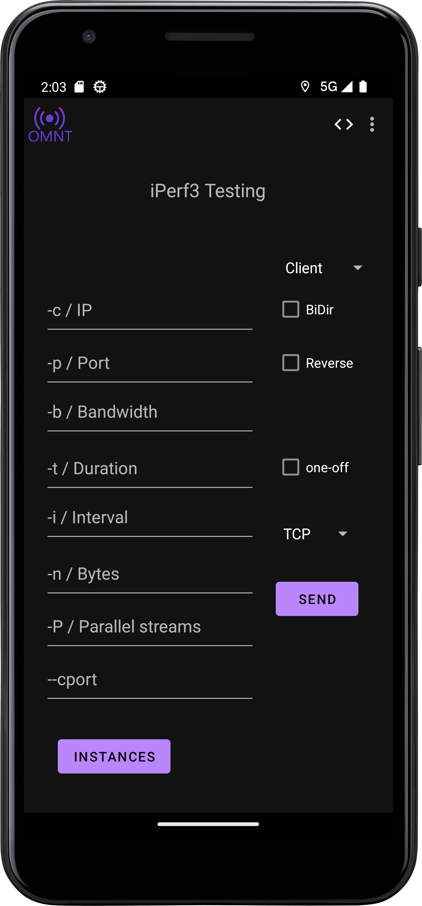
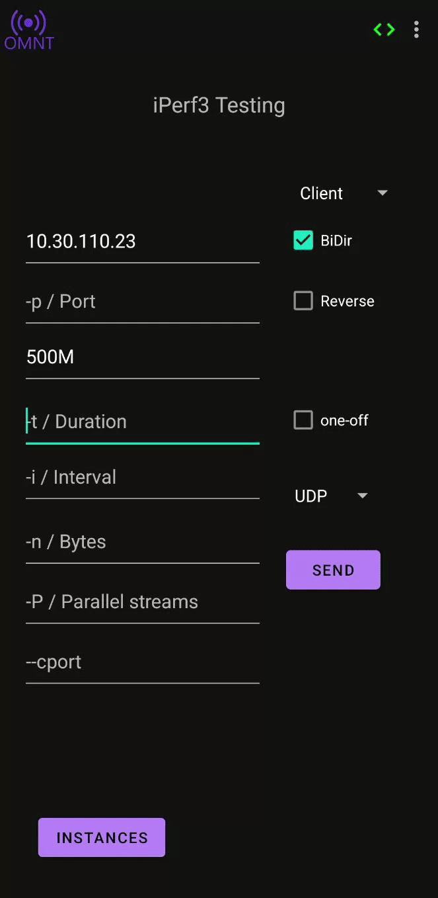
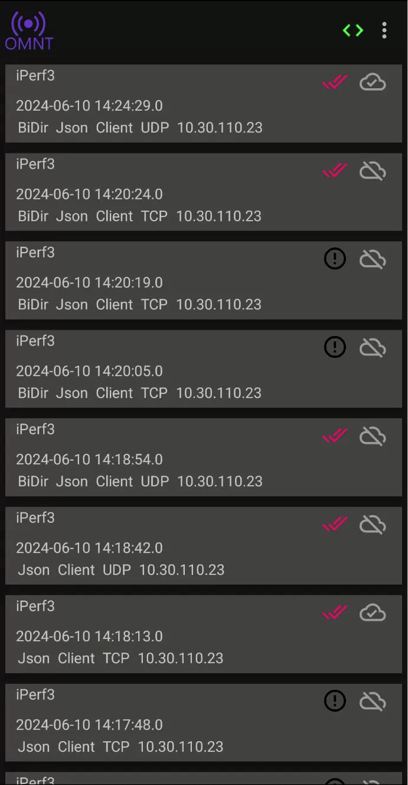

## iPerf3
iPerf3 has been compiled with a [JNI](https://developer.android.com/training/articles/perf-jni) interface to enable OMNT to call it using the specified parameters.
To see how to integrate iPerf3 into your app, look at [iPerf3 Repo](https://github.com/omnt/iperf)

### Icon Legend
-  - iPerf3 run is not uploaded 
-  - iPerf3 run is successfully uploaded

-  - iPerf3 run is running
-  - iPerf3 run is done
-  - iPerf3 run has an error

### Usage
To use iPerf3 it is pretty simple. 
You can type into the GUI the server IP and port, the duration of the test, and the bandwidth. 
You can also choose the protocol you want to use, TCP or UDP.

### Results
The results of the iPerf3 test are displayed in the GUI.

### Local Logging
The local results of each iPerf3 run are logged in `/sdcard0/Documents/omnt/iperf3RawLogs/`.
Each log gets converted into a https://docs.influxdata.com/influxdb/cloud/reference/syntax/line-protocol/ file, which is saved at `/sdcard0/Documents/omnt/iperf3LP/`.

### Upload to Remote InfluxDB
If the Influx parameters are set correctly (refer to [Logging -> Remote Logging](settings/logging.md)), the results of the iPerf3 test will be uploaded to the InfluxDB. 
InfluxDB Remote Logging needs to be enabled.
If the upload to InfluxDB fails, the logs can be uploaded manually.

[Home](OpenMobileNetworkToolkit.md)