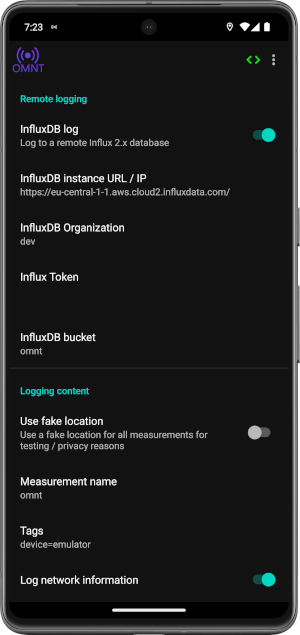

# Quick start guide

This guide aims to bring you quickly to a working setup with InfluxDB and Grafana by using the cloud accounts. You will be able to store your measurements in an InfluxDB instance and visualize the data with our example dashboard in Grafana. This guide further assumes you have an Android phone with a compatible Android Version and you either already know how to build OMNT yourself or a release APK.

Note: If you run your own Grafana / InfluxDB you can jump ahead to [Setup OMNT](#setup-omnt).
If you want to setup Grafana and InfluxDB yourself checkout:
* https://docs.influxdata.com/influxdb/v1/introduction/install/
* https://grafana.com/docs/grafana/latest/setup-grafana/installation/

# Accounts
This guide assumes you will use the free cloud accounts of InfluxDB and Grafana. If you don't have accounts for both services:

  * https://cloud2.influxdata.com/signup
  * https://grafana.com/products/cloud/

both services can be used for free to get a first impression, more advanced usage will require a paid subscription or a private / on prem instance.

# Installation
The simplest way to install the app is by downloading it on the phone, if ADB is at hand installing via adb more convenient.
The latest release APK can be found on the [Github release page](https://github.com/omnt/OpenMobileNetworkToolkit/releases/).

    adb install release.apk

or use android studio to build and install OMNT. Follow [build](build.md) for more information on building the app.

# Setup InfluxDB
Log into your influxDB account and hover over the top symbol in the right menu bar (below the influx logo), in now visible menu select ```buckets```. Click on the ```Create bucket``` button in the top right of the screen. You can name the bucket what ever you want e.g. ```omnt```.

Next click on the ```api token``` tab and create an API token. Again naming is up to you. 
For simplicity create an ```all access``` token. 
Make sure to copy the token somewhere you find it later, it will not be shown again.

On the top of the window you see you organization, most likely something like ```dev```, write this down to.

The last information you need from influx is the url to your instance. It depends on the cloud zone you choose and will look e.g. like this ```https://eu-central-1-1.aws.cloud2.influxdata.com/```

# Setup Grafana
Log into your Grafana account and add a new data source by selecting ```Connections``` and than ```add new data source```. Now choose ```InfluxDB``` and click on ```add data source```.
Name the data source what ever you like. As our sample dashboards using Flux as query language select ```flux``` from the dropdown menu. If you later develop you own dashboards you can also use InfluxQL or SQL on the same data.

Scroll down to ```InfluxDB Details``` and enter the information written down during the InfluxDB setup. 
Click on ```Save & Test```

Now you can import the sample dashboards provided at https://github.com/omnt/Dashboards .

# Setup OMNT
## InfluxDB Settings
Now its time to open OMNT and configure its logging component. Touch the three dots in the right top corner to open the app menu. Select ```Settings``` and open the ```Logging``` setting page.



Fist scroll down to ```Remote logging``` here we configure the credentials for remote InfluxDB. 
1) Toggle the ```InfluxDB log``` switch.
2) Copy the url you saved before to ```Influxdb instance URL/IP``` option. 
3) Copy the organization id to the ```InfluxDB Organization``` option.
4) Copy the token to the ```Influx Token```
5) Copy the bucket id to ```InfluxDB bucket```

## Logging Content
Here we configure what data should be written to the database. Note that this also affects the log file. 
* User Fake location: This will prevent you real location showing up in your logs. Mostly useful for developers.
* Measurement Name: This name will be used to identifier your measurement later on.
* Tags: This should at least have ```device=YourDevice``` as a tag. Further tags can be added comma separated.
* Log network information: log data displayed in the network information card on the home screen
* Log signal data: log data displayed in the signal info card on the home screen
* Log cell information: log data displayed in the cell information card on the home screen
* Log neighbor cells: include neighbor cells in the log
* Log throughput data: log interface throughput statistics
* Log battery information: include current battery and charging state in the log
* Log IP addresses: Include current IP addresses in the log

If everything is set up you can now scroll up to the top of the logging settings and enable the logging system. If your phone has a internet connection the logging logo will tun green when data is successfully transmitted to the database.

You should now see the device and measurement selectable in the dashboards and graphs and maps filling with data points.

[Home](OpenMobileNetworkToolkit.md)
